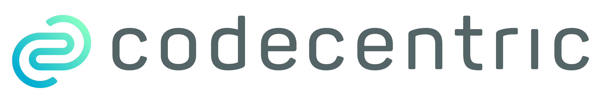
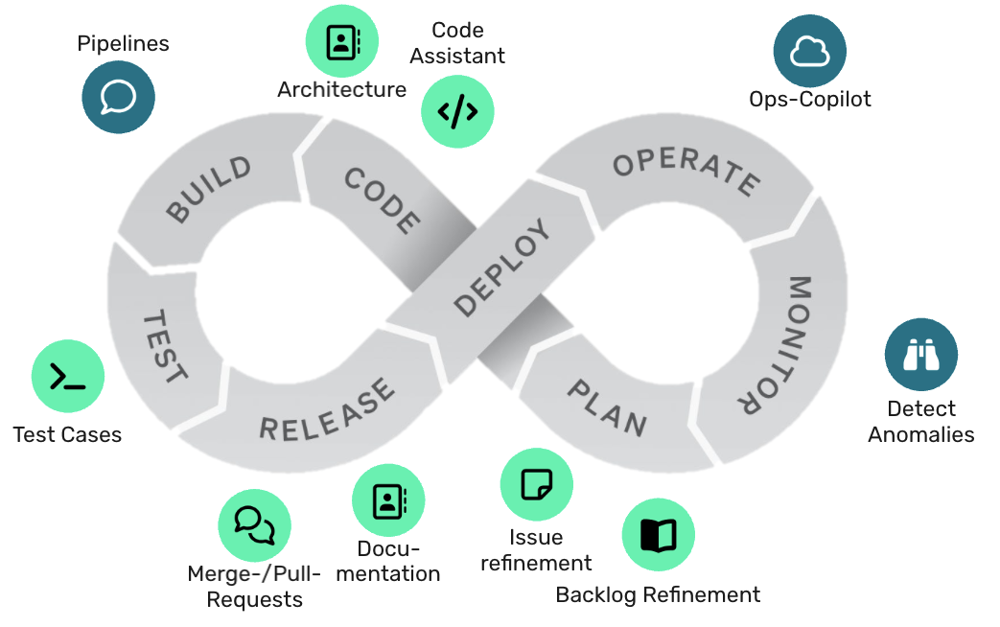

<div align="center">

<a href="https://www.codecentric.de/">
  
</a>

# SDLC mit KI-Unterstützung

**Eine Projektvorlage, an der der komplette Software Development Lifecycle
durchgespielt wird** — vom rohen Backlog-Eintrag bis zur aktualisierten
Dokumentation.



</div>

---

## Worum es geht

KI hilft nicht nur beim Schreiben von Code, sondern an jeder Station des Loops.
Diese Vorlage bildet den Ausschnitt von **Plan bis Release** ab und macht ihn
begehbar: Jeder Schritt erzeugt eine Markdown-Datei, die der nächste als Input
liest.

```
unrefined  →  refined  →  plan  →  Implementierung  →  review  →  docs
              ↑ DoR                       ↑ Tests       ↑ DoD       ↺
```

Diese Dateien steuern die KI und machen ihre Arbeit wiederholbar, überprüfbar
und im Team teilbar. Ein Ticket wandert sichtbar durch die Ordner, statt in
einem Tool zu verschwinden.

## Einstieg

| Ich möchte… | |
| --- | --- |
| einen Durchlauf starten | [Anleitung im Konzept](CONCEPT.md#loslegen) |
| verstehen, wie hier gearbeitet wird | [`CONCEPT.md`](CONCEPT.md) |
| den Prompt für einen Schritt | [`sdlc/standards/prompts/`](sdlc/standards/prompts/README.md) |
| den SDLC-Stoff auffrischen | [`prerequisites/`](prerequisites/README.md) |

## Aufbau

```
sdlc/            Prozessartefakte — Stories, Pläne, Reviews, Standards, Prompts
docs/            Architekturdokumentation, Diagramme, Entscheidungen
tests/           Testcode und Testdaten
prerequisites/   Hintergrundmaterial zum Nachlesen
```

Jeder Ordner erklärt sich in seiner eigenen `README.md`. Die Details zum
Prozessfluss stehen in [`sdlc/README.md`](sdlc/README.md).

## Zustand

Dieses Repository ist eine **Vorlage**: der Prozess steht, das Projekt fehlt.
Domäne, Tech-Stack und Anwendungscode bringt jeder Durchlauf selbst mit.

---

<div align="center">
  <sub>Entstanden im Workshop <em>AI-Assisted Coding</em> ·
  <a href="https://www.codecentric.de/">codecentric AG</a></sub>
</div>
